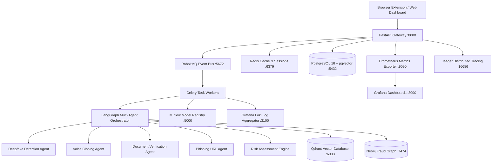

# TrustShield AI — SEBI Financial Trust & Fraud Intelligence Platform Architecture Record

## Executive Overview
The **TrustShield AI Platform** is a multi-modal, real-time fraud detection and scam prevention platform engineered to protect Indian retail investors from sophisticated SEBI-related scams (deepfake videos, cloned voice calls, fake circulars/PDFs, phishing domain typosquatting, QR codes, WhatsApp/Telegram pump-and-dump schemes).

The backend is built following **Clean Architecture**, **SOLID principles**, and **12-Factor App methodology**, scaling across a 14-service containerized ecosystem.

---

## Ecosystem Architecture & Service Topology

---

## Core Component Responsibilities

| Service Component | Tech Stack | Role & Responsibility |
|---|---|---|
| **API Gateway** | FastAPI (Async Python 3.11+) | Ingestion REST APIs, RBAC auth, Rate Limiting, OWASP Security Headers |
| **Multi-Agent Engine** | LangGraph 0.2+ | Parallel fan-out multi-modal analysis (Deepfake, Voice, Document, Phishing, Risk) |
| **Event Bus** | RabbitMQ 3.9 | Asynchronous event publishing (`case.uploaded`, `analysis.completed`, `case.dlq`) |
| **Task Queue** | Celery 5.4 + Redis | Async background worker execution |
| **Vector DB** | Qdrant 1.11 | High-dimensional regulatory knowledge embeddings & case similarity search |
| **Graph DB** | Neo4j 5.23 | Entity relationship graph (Victims, Scammers, Telegrams, Domains, Wallets) |
| **MLOps Registry** | MLflow 2.14 | Experiment tracking, model versioning, Precision/Recall/F1/Latency metrics |
| **Observability** | Prometheus + Grafana + Jaeger + Loki | End-to-End metrics, dashboards, distributed tracing, and centralized logging |
